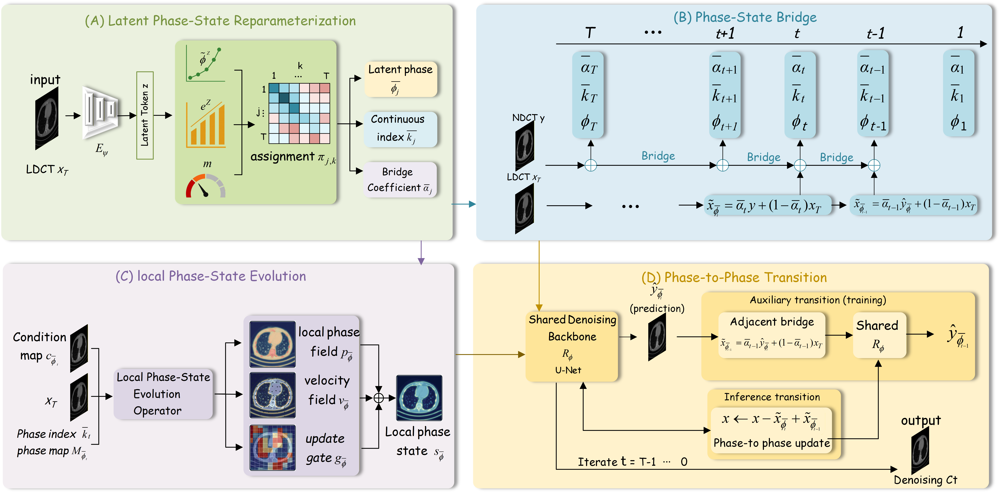

# LPSDiff: Latent Phase-State Diffusion for Low-Dose CT Image Denoising


This is the official implementation of the paper  **"Reparameterizing Restoration States: Latent Phase-State Diffusion for Low-Dose CT Denoising"**.


## Project Introduction

<p align="center">
  
</p>

<p align="center">
  <em>Figure 1. Overall architecture of LPSDiff.</em>
</p>


## Data Preparation

- The AAPM-Mayo dataset can be found from: [Mayo 2016](https://ctcicblog.mayo.edu/2016-low-dose-ct-grand-challenge/).
- The AAPM-Mayo dataset can be found from:[Hybrid-DL-IR-Data](https://data.mendeley.com/datasets/j7khwb3z3r/1)
- The Piglet Dataset can be found from: [SAGAN](https://github.com/xinario/SAGAN).


## Requirements
```bash
- Linux Platform
- torch==1.12.1+cu113 # depends on the CUDA version of your machine
- torchvision==0.13.1+cu113
- Python==3.8.0
- numpy==1.22.3
```

## Training and Inference

### Training

```bash
python main.py 
```

### Inference & Testing

```bash
python test.py 
```
